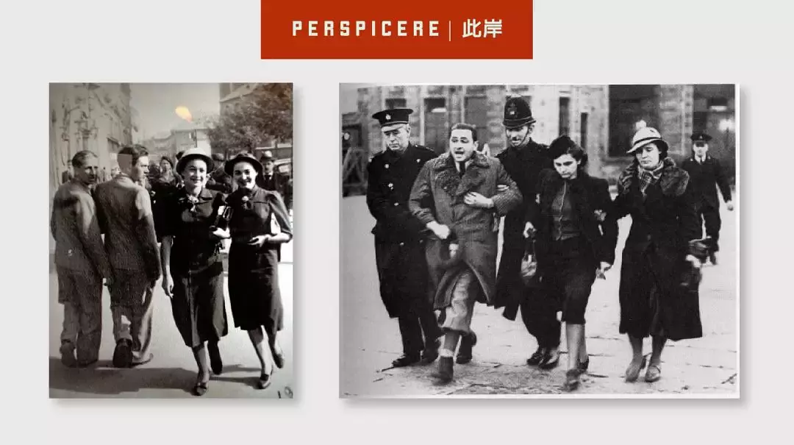
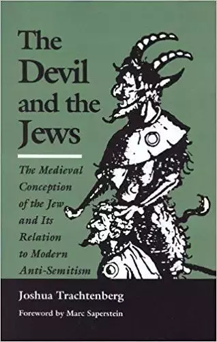
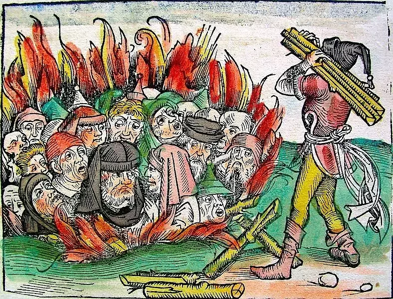
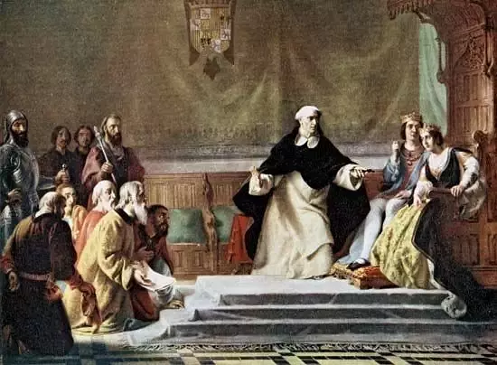
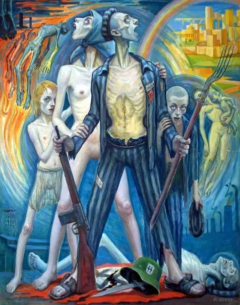

title: "纳粹屠杀前的欧洲恐犹症和排犹史"
preview: '本文将跟随克劳斯·费舍尔的分期叙述，试图勾勒出二战之前的欧洲基督教世界恐犹和排犹的历史演变，以及基督教世界排犹的幻觉本质与纳粹的屠杀之间的历史逻辑联系。'
date: 2018-03-29 20:38:52 +0800
author: mengxi
cover: "-/images/arendt-isolation-oppression/1.png"
tags:
    - 种族
    - 历史
    - 犹太人
    - 战争
editor: "马特"
proof-reader: "Yanyan"
design: "孟溪,姜如月"
type-setting: "付安琪"

---

1939年9月1日，阿道夫·希特勒同时发动了两场世界大战：一场是针对波兰及其盟友的传统军事战争，另外一场则是针对欧洲犹太人的生物学种族战争。后一场战争导致了现代史上最大的罪行——对犹太人的大屠杀。纳粹屠杀被视为一个独一无二的历史事件，人类历史上，还没有一个事件能与之相比。因为不同于以往战争中的屠杀，它是第一场由一个现代工业国家发起、资助和组织的，对六百万犹太人流水线式的系统性种族灭绝。

<small style="color:gray;">The Holocaust - Unable To Work 作者 David Olère (1902 – 1985）</small>

至今，许多学者仍被这样一个问题所困扰：**为什么这样的恶行会发生在先进的西方文明？为什么是德国，这个产生过最优秀的科学家、音乐家、哲学家、神学家和作家的国度**？二战后，有些流行的论调将纳粹屠杀归因于德国人的独特性，宣称他们是天生的种族主义者和军国主义者。

丹尼尔·约拿·戈德哈根（Daniel Jonah Goldhagen）正是持这一论调的典型代表。他在《希特勒的志愿行刑者》一书中表示，纳粹对犹太人的屠杀行为无法用超越历史和文化的普遍人性来解释，而应归咎于德国人独特的政治文化血统。[1]

保罗·劳伦斯·罗斯（Paul Lawrence Rose）的《德国问题/犹太问题：从康德到瓦格纳的革命反犹主义》和约翰·魏斯（John Weiss）的《死亡的意识形态：为什么犹太屠杀发生在德国》也从德国民族独特的历史经验来寻找原因，认为自中世纪到现代，反犹情绪深深根植于德国精英的思想中，且从未间断过。[2]

克劳斯·费舍尔（Klaus P. Fischer）在《强迫症的历史：德国人的犹太恐惧症与大屠杀》中批评道，这一论调无非是纳粹反犹的种族主义信条的变调而已，即，由于遗传因素，某一类族群天然就是邪恶的。**尽管在范围和程度上，纳粹对犹太人的种族屠杀都是史无前例的，但对犹太人的恐惧和仇恨并非为德国所特有，而是整个欧洲共有的历史传统**。

事实上，**构成纳粹仇犹心理的关键因素早在先前的历史事件中就初现端倪，尤其是在中世纪的欧洲，基督教世界酝酿了基督徒对犹太人的“天然”敌视**。伴随这一敌视，关于犹太人的各种神话和幻觉相继出现，它们最终发酵成为欧洲历史上针对犹太人的一次次血腥屠杀，被强化为了一场“仇恨”运动。[3]

因此，如果想要对导致这一事件的历史动因有个相对清晰的了解，我们首先应当将它置于更广阔的历史和地域背景之中，回溯到恐犹和排犹意识的萌芽、发展时期。在这个意义上，**纳粹对犹太人的屠杀首先应被视为一个历史延续的产物，“是‘人性之恶’的历史表现，这种恶存在于过去，也很有可能在未来复现”**[4]；其次，才是欧洲历史上普遍存在的仇犹情绪以德国所特有的形式被现实化。

关于恐犹和排犹情绪在欧洲历史上的演变过程，费舍尔将它分为了五个独特的时期：

1. 古代：当时的仇犹情绪相对温和。
2. 基督教的出现和扩张时期：该时期仇犹达到一个高潮。基督徒视犹太人为杀死基督的凶手，认定他们是一群得不到救赎的人。该时期标志是十字军东征的暴力或宗教法庭，以及此后，在个人与团体中不断出现的关于犹太人的各种幻觉。
3. 宗教战争期间（1540-1648）和启蒙时期（1650-1815）：这段时期恐犹情绪出现暂时的缓和。
4. 19世纪：在国家主义和种族主义的影响下，恐犹以新的、更具破坏力的形式重新出现。
5. 第一次世界大战和纳粹运动：恐犹海啸在纳粹屠杀中达到顶点。

本文将跟随费舍尔的分期叙述，试图勾勒出**二战之前的欧洲基督教世界恐犹和排犹的历史演变，以及基督教世界排犹的幻觉本质与纳粹的屠杀之间的历史逻辑联系**。

## 1. 犹太人的历史际遇：“难以被消化”的民族

犹太人被修·特维罗伯（Hugh Trevor-Roper）称为“难以被消化的民族”。19世纪前，绝大多数的犹太人严格坚守着法利赛教派的犹太主义（Pharisaical Judaism）。该教派的目的是将犹太社区与外部世界隔绝，将信徒们牢牢地束缚在日常例行的圣经规则和宗教实践之中。这样，他们成为了“国中之国”，与外部世界的关联只是纯粹的经济联系。

<small style="color:gray;">十六世纪的犹太放贷者</small>

他们强烈地坚守着神圣法律和祖先的传统，在漫长的岁月里，他们幸存下来了，但也受尽了外部世界的折磨。在社会生活和政治活动上，犹太人与外部世界是隔绝的，也是低人一等的。在外部世界里，他们永远是软弱的外人，**他们的身份被统治民族所定义，因而沦为那个社会的一项发明**。由于没有定义自我的权利，他们被迫接受主流社会强加于他们的刻板印象。

过去的三千年里，从没有一个民族像犹太人那样，既受人钦佩也被人嘲笑、既让人害怕也深受迫害、既遭人轻视也被妖魔化。法老在埃及奴役他们，亚述人夺取了他们的北方王国（以色列），巴比伦的尼布甲尼撒二世毁掉了他们残余的国土（犹大），并在“巴比伦之囚”中带走了上万名犹太俘虏，希腊人和波斯人镇压并驱散了他们。

罗马人夺走了犹太人在巴勒斯坦的故土，又把他们驱逐到世界各地，伊斯兰教的狂热信徒定期对他们发动袭击，基督教的十字军在发动圣战之前先屠杀了上千名犹太人，西班牙宗教法庭把他们驱逐出了伊比利亚，波兰人和俄罗斯人充满敌意地对他们进行了多次种族屠杀，而德国人通过消灭600万犹太人，将这长久以来的仇犹情绪推向了极点。

## 2. 基督教世界的集体幻觉：邪恶的犹太人

在古代欧洲，犹太人就被视为一个外来的可疑民族，但直到基督教的出现和扩张，犹太人才被安上了杀害上帝之子（耶稣）与魔鬼同谋的罪名，成为一个“天然有罪”的民族。这个影响深远的历史转折点发生在圣保罗(St. Paul)时期。由此种下的仇犹种子，在1096年的十字军东征之前，发酵成针对犹太人的、跨越国界的群体性暴力事件。而在黑死病流行的1347年，因为“井中投毒”的指控，犹太人开始被等同于无处不在的、神秘而邪恶的力量。

<small style="color:gray;">《The Devil and the Jews》封面</small>

### 为耶稣之死负责：恶魔化犹太人的开端与扩散 

 从圣保罗开始，基督教发生了两个决定性的改变：一是从只接受犹太人入教变为对所有信徒开放；二是将把耶稣钉上十字架的罪责从罗马人身上转移到了犹太人身上。一旦国家基督教化，针对犹太人的法律限制就开始了。从罗马帝国后期开始，一直持续到中世纪早期，许多犹太人在古代所享有的特权被废止、劝人入犹太教被禁止、拉比的司法权被剥夺和废除、与基督徒的性行为被禁止，绝大多数的法律保障也一并被取消。

继宗教敌视和法律歧视之后，1096年，即第一次十字军东征的那一年，则是基督教世界普通民众仇犹情绪的转折点。当年，在十字军东征之前，一些狂热的十字军战士从他们的基督教恐惧和怀疑中生出了特殊的仇犹情绪。他们袭击了法国和德国北部的犹太区，任意地屠杀了数千犹太人。
 
对他们而言，这是一次合法行动，因为犹太人不但谋杀了耶稣，而且还没有认识到自己的错误而皈依基督教：“瞧！替他报仇的时间已经到来，那个被钉死在十字架上的人，那个被他们的祖先杀死的人。现在，不要让任何人逃脱，即使是一个在摇篮中的婴儿或乳儿。”[5]

当时，杀死犹太人甚至被视为值得赞赏的基督徒行为，因为“只要杀死一个犹太人，任何人的所有罪过都会被赦免。”[6]许多犹太人因此被基督徒出卖、抛弃、移交给凶残的狂热分子，而这些基督徒正是他们和平相处多年的邻居。

1096年的事件是仇犹情绪累积到一定程度的爆发。它的历史意义在于：“从第一次十字军东征开始，反犹迫害开始反常地蔓延，……恶化为超越国界的群体性精神错乱。”[7]1096年及此后的十字军东征或中世纪欧洲剧变的特殊之处都在于仇犹情绪的“幻觉”本质，即这一仇恨完全是基于不断增加的、对犹太人和关于他们邪恶行径的荒唐信念之上。[8]

### 谣言层出不穷：集体性恐犹幻觉的累积

到中世纪晚期，欧洲普通民众对犹太人产生了至少十种幻觉，其中，较为重要的有寄生虫、冥顽不化、与魔鬼结盟、血祭诽谤和杀童祭礼、犹太世界的阴谋、井中投毒。

因为被禁止拥有土地（而这正是中世纪权力的主要来源），同时也被排挤于团体之外，犹太人被迫在经济上从事被基督徒视为既低等又不道德的职业，如放贷。从事这行的犹太人获得了非常重要的经济能力，但也因此面临许多恶意的指控，被指责为依附于基督徒邻居、不事生产的寄生虫。

另外，由于犹太人拒绝信仰被基督徒视为自明的真理（尤其是“耶稣就是弥赛亚”的信念），基督徒认为犹太人冥顽不化。有一个传说声称，（世界末日前的）基督复临以犹太人改信基督教为前提，因此犹太人拒绝改宗激怒了基督徒。

**如果耶稣就是弥赛亚，那么犹太人所等待的只能是“敌基督”（antichrist）**。[9]据此，基督教作家们到处散布犹太人是敌基督支持者的谣言。犹太人与魔鬼的联系可以在新约和早期的教堂神父（如Gregory of Nyssa或St. John Chrysostom）的作品中发现，他们将犹太人描绘成**具象化了的撒旦**，[10]其后果之一是，**基督徒将自己所怀有的恐惧和仇恨都投射到了犹太人身上**。

此外，有传言说，犹太人需要周期性地注入基督徒的鲜血才能维持健康，而其中最强效的莫过于基督徒儿童的血。于是，用儿童献祭并喝下他们的血，这个古代人祭的神话（“神话”一词暗示犹太人用儿童献祭的传言具有虚构和幻想的性质）又被置于犹太人杀童的新形式中被表达出来。

<small style="color:gray;">传说中的犹太人杀童献祭</small>

1144年，英国通报了第一起儿童谋杀案：在耶稣受难日前一天的晚上，一具年轻学徒的尸体在近诺威奇的树林里被发现。随后流言四起，说是当地的犹太人遵照拉比教义的指示犯下这个罪行，以嘲笑救世主的受难。这个事件引发了整个欧洲一连串的儿童献祭案件，每一次都产生了诬告、暴乱和对无辜犹太人的屠杀。[11]

与儿童献祭有关的还有犹太世界阴谋论，即世界上的犹太人都受某神秘犹太教祭司密谋者们的组织和控制，这些人密谋削弱基督教文明。尽管这一阴谋论明显很荒谬，但仍有人相信拉比教义的信徒谋杀基督徒儿童来献祭的谣言，以至于让它成为了继十字军之后又一个为大规模灭绝犹太人的行动辩护的正当理由。

还有一个对犹太人重要的指控是井中投毒。据传，1321年的夏天[12]，在法国南部的阿基坦公国（duchy of Aquitaine），一个麻风病人在帕特纳领主（Lord of Parthenai）的领地里被捕，他供认是一个犹太人给了他一个有毒的包裹，里面装着人的血、尿和三种神秘草药，以及从神圣的主那里获得的粉末，并指示他把这个包扔到一口井里。[13]这一指控在之后的黑死病事件（1347-50年）中得到了强化。对于黑死病的恐慌让人们精神错乱，他们开始轻易相信任何荒唐、非理性的谣言。

在利昂·波利亚科夫（Leon Poliakov）看来，1347年的历史重要性可与1096年相提并论，因为除了被视为撒旦或愤怒的上帝，或两者兼有的一般宇宙力量外，对于普通民众而言，井中投毒事件表明**邪恶力量如今无处不在：它正在被释放，正在污染空气、毒化水源**。在这里，犹太人扮演了一个替罪羊的角色。无论什么，只要是基督徒觉得厌恶的，他们就将它转嫁于犹太人。

<small style="color:gray;">黑死病期间焚烧犹太人祭</small>

至此，到中世纪晚期，绝大多数现代恐犹症的要素已基本形成，这种仇恨最终来源于基督教文化本身的脆弱和不安全感。从心理学角度讲，恐犹是基督徒对基督教真理内在质疑的表达；能够平息这种质疑的一种方式便是将犹太人钉上十字架。

## 3. 幻觉之下欧洲犹太人的命运：被驱逐、短暂的融合、新的冲突

后来，这些人身侮辱继而转变成为物理空间上的种族隔离和驱逐。1290年，犹太人被爱德华一世（Edward I）驱逐出英国，直到17世纪中叶才有犹太人返回英国。此后的几十年里，他们也被驱逐出法国和德国的许多城镇。

15世纪晚期，在基督教夺回西班牙期间，犹太人同摩尔人一起成为宗教法庭审讯的对象。这个宗教法庭设于1478年的西班牙，用以辨认异教徒和基督教异端。它的第一个审判官，托马斯·托尔克马达（Thomas Torquemada，1420-98）就引发了一场恐怖行动，有许多犹太人在这次行动中被杀害。

<small style="color:gray;">西班牙宗教法庭审判异教徒和基督教异端</small>

另外，该宗教法庭还严格地监控着皈依基督教的犹太人，这些人被称为马拉诺（marranos，指表面上皈依基督教但私下仍信奉犹太教的犹太人）或猪（西班牙语marrano，意为猪，源于犹太教禁止吃猪肉）。他们中的许多人在西班牙已有了很高的社会地位，西班牙人对这些改教的犹太人的不信任，揭示出了他们对所有犹太人的深深怀疑，这一次，他们又制造出了许多有关犹太人丑陋、新奇的刻板印象。**犹太血液低劣**说是其中之一，认为犹太人的血会产生恶劣的性格，并且不可改变，会通过遗传一代代延续下去。

正是这个学说，生物学种族主义第一次在历史上出现，尽管只是一个雏形，但它足以说明第一个沉迷于血液污染和血液净化的团体并不是纳粹。仅仅13年之后，当基督教完全夺取西班牙之时，费迪南德（Ferdinand）和伊莎贝拉（Isabella）将犹太人驱逐出了西班牙，葡萄牙则在1498年紧随其后。**到1500年，整个西欧，除了德国和奥地利的少数地区以外，已经没有了犹太人**。

<small style="color:gray;">犹太人中世纪被驱逐路线</small>

**在中世纪结束时，“犹太人”已经从真正的人类降格为一种丧失人性、十分邪恶的神话(虚构)形象。对犹太人的仇恨被视为一种美德**。事实上，正如史蒂芬·卡茨（Steven T. Karz）提醒我们的，一个人越是仇恨犹太人，就表明他越虔诚。[14]因此，认为犹太人在精神上堕落的信念是由基督教会而不是纳粹发明的。在这个神话的信念之上，纳粹所增加的：一是，对犹太人堕落起源的一个不同版本的解释，他们认为犹太人的堕落根源于“犹太人的血液”而不是犹太教；二是，一个不同的处理方法——在此处和当下灭绝他们。

当启蒙运动到来，人类意识经历了一次重大转变：世界开始脱去（宗教的）神话色彩，人们开始相信自然界的物体运动服从于理性规律，并且能够被人的心智所理解。于是，基督教千禧年的精神被世俗化，启蒙运动用更乐观和包容的语言向世人宣称，人类的本质都是善的，其中当然也包括犹太人。

1791年，法国大革命议会赋予犹太人完全的公民身份，而其他在法国统治下的地区，莱茵兰（Rhineland）、威斯特伐利亚（Westphalia）、瑞士（Switzerland）和意大利北部，也都照做了。此后，在一个相对融洽和宽容的后拿破仑时代，在法国和德语地区的犹太人开始壮大，并获得了更高的社会关注。

但短暂的宽容氛围很快就结束了，犹太人在德国遭到了国家主义的激烈反对。与其他西欧国家相比，**德国的恐犹症有其特殊性：首先，不同于英国和法国，犹太人从没有被完全地驱逐出德国国境，他们仍旧现实地与德国人生活在一起，而不是仅仅存在于民间传说和艺术之中；其次，由于第一个原因，恐犹症成为了一个延续和持久的历史传统；第三，德国人一直以来缺少一个统一的国家身份，更容易陷入国家主义的魔咒**，最终将他们自己限定在一个狭隘的文化和非理性的种族界限内，以至于越来越多的德国人拒绝接受与非德意志民族或其他宗教的少数族裔融合，尤其是犹太人。

## 4. 纳粹屠杀：恐犹幻觉在德国的重生

在19世纪的最后25年里，一种新的恐犹症——生物学的种族主义——搅动了欧洲，同时也成为产生纳粹心态的土壤。生物学的种族主义是由达尔文的追随者提出的伪科学理论。他们误读了达尔文的生物学发现，把它用于自己的意识形态宣传。19世纪晚期的思想家，尤其是那些生活在非民主或不自由的社会（如德国、奥匈帝国和俄罗斯）中的思想家们，开始抛弃启蒙运动的价值，不再理会平等、民主、自然权利和理性。这是一个对现代犹太人影响深远的文化转向。

纳粹对犹太人的仇恨深深地根植于整个欧洲的历史和宗教，是久远的恐犹传统的重生。正如阿尔诺·迈尔（Arno J. Mayer）所言，**过去的精神剧变——尤其是十字军东征和宗教战争期间的群体性狂热——会一再重现**。纳粹对犹太人的屠杀是第二次三十年战争[15]的结果，是对过去种族屠杀的一次更加可怕、更具破坏力的重复。[16]   

费舍尔认为，迈尔的这一论点虽然在某种程度上削弱了纳粹屠杀的独特性，却正确地指出了，**欧洲人在多样的圣战**（如十字军东征、对异教徒的镇压，或在宗教改革时代的宗教毁灭）**中所注入的文化力量并没有随着1648年宗教战争的结束而减弱**，反而在后世被重新激活，或者说，在18世纪短暂的平静之后，**这种文化力量以不同的形式在德国人非理性的集体意识中复活**。

虽然在很大程度上，意识的建构是一个符号的或文化的过程，但因为它的结构并不是完全理性的，它会被非理性的恐惧、妄想和激烈的情感所塑造。在致幻力量的影响下，集体意识可以部分或全部地转变为一种神话的或妄想的意识，从而产生对现实完全不同的感知。

随着时间的推移，**整个团体会被一些异常的非理性思维所控制，而植入进意识形态的文化力量又总是能把群体性幻觉转变为攻击性行为**。在最糟糕的时期，当所有的事物似乎都在密谋反对一个特定的群体（如中世纪的基督教徒、一战后陷入困境的德国人）时，集体意识就会退化至前逻辑的（prelogical）或神话的（mythical）状态。事件的发生不再被视为服从于正常的因果过程，而成为隐蔽、变幻无常的力量的展示。在这个混乱的世界里，这个被误导的团体有一种漂泊感和颓丧感。

<small style="color:gray;">La révolte du Sonderkommando d’Auschwitz-Birkenau，作者 David Olère (1902 – 1985）</small>

**对幻觉体系的盲目信念在人类历史上反复出现，希特勒的纳粹德国无非是宗教预言的世俗对应物，是一再重现的圣战幻觉的又一个现实产物**，即向他的追随者们宣传，他们不是被征服者，而是上帝或历史的选民，他们的作战目的是打击折磨他们的人。而与折磨者（无论是撒旦还是犹太人）的相遇是即将到来的末日决战中的重要组成。[17]在这种幻觉的刺激下，纳粹意识中充斥着一种**急迫感——邪恶力量似乎已经占据上风**。既然如此，对纳粹而言，就有必要以**一种激进的方式将邪恶从当下和此地根除。以对灵肉毁灭的极端恐惧为基础，任何扭曲现实的妄想症必然地将灭绝战略作为将自己从苦难中解脱出来的唯一疗剂**。

在费舍尔看来，当被置于更为广阔的历史视域中时，纳粹对犹太人的屠杀并非一个全然烙着德意志民族政治和文化特性的孤立历史事件。或者说，从根源上看，它仅仅是欧洲基督教世界原有的、非理性的历史精神或文化力量的延续和再表达，是旧的恐犹幻觉在新形式中的自我揭示。这一历史精神或文化力量源于基督教文化内部的脆弱、怀疑与恐惧，形成于基督教世界的集体性幻觉，而后又深深地潜藏回这个群体的集体意识之中，且**在新形式的刺激下，这种致幻力量随时都可能被唤醒**，转变为对被恶魔化群体的集体暴力。

---
引用：

1. Daniel Jonah Goldhagen, Hitler’s Willing Executioners: Ordinary Germans and the Holocaust (New York: Knopf, 1996), p. 408.

2. 如马丁·路德本人就被认为是一个反犹的种族主义者，见Paul Lawrence Rose, German Question/Jewish Question: Revolutionary Anti-Semitism from Kant to Wagner (Princeton, N.J.: Princeton University Press, 1990); John Weiss, Why the Holocaust Happened in Germany (Chicago 1984).

3. Fischer, Klaus P.,The History of an Obsession: German Judeophobia and The Holocaust(New York: Continuum, 1998), p. 26.

4. Fischer, Klaus P.,The History of an Obsession: German Judeophobia and The Holocaust(New York: Continuum, 1998), p. 7.

5. Robert Chazan,In the Year 1096: First Crusade and the Jews(Philadelphia: Jewish Publication Society, 1996), p. 31.

6. 同上, p. 23.

7. 同上, p. 132.

8. Gavin I. Langmuir,Toward a Definition of Antisemitism(Berkeley University of California Press, 1957), p. 17.

9. Joshua Trachtenberg,The Devil and the Jews: The Medieval Conception of the Jew and Its Relation to Modern Antisemitism(New Haven: Yale University Press, 1943), p. 32.

10. Robert Wistrich,Anti-Semitism: The Longest Hatred(New York: Schocken, 1994), p. 17.

11. Fischer, Klaus P.,The History of an Obsession: German Judeophobia and The Holocaust(New York: Continuum, 1998), p. 33.

12. 这个时间在Klaus P.的文中没有提及。根据Leon Poliakov的原文所加，见 Leon Poliakov,History of Anti-Semitism(New York: Schocken, 1974), p. 104.

13. Leon Poliakov,History of Anti-Semitism(New York: Schocken, 1974), pp. 104-105.

14. Steven T. Karz,The Holocaust in Historical Context(New York: Oxford University Press, 1994), 1: 259.

15. 史学家用来指称从1914年到1945年间发生在欧洲的战争。

16. Arno J. Mayer,Why Did the Heavens Not Darken? The Final Solution in History(New York: Doubleday, 1969), p. 123.

17. James M. Rhodes,The Hitler Movement: A Modern Millenarian Movement(Stanford, Calif.: Stanford University Press, 1980), p. 30.