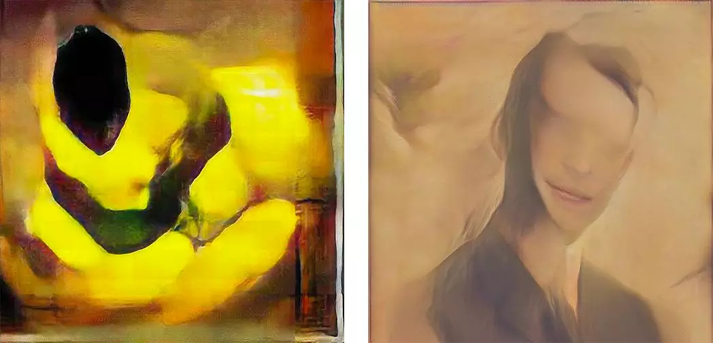
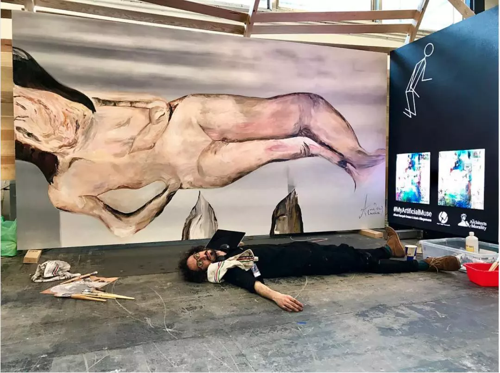
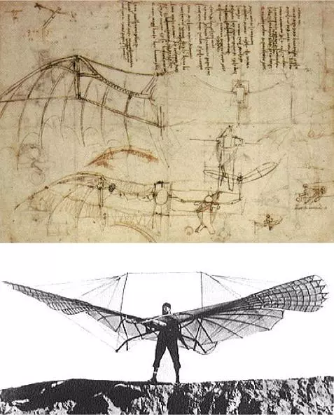

title: "机械生成时代的艺术"
date: 2018-03-10 20:38:40 +0800
author: liuguo
cover: "../images/generated-art/0.webp"
tags: 
  - 数字艺术
  - 人工智能
  - 技术与社会
preview: '不管未来如何不确定，技术的发展和知识的流通至少会让人与人之间的机会与选择更加平等。艺术化的技术则会唤起更多人对技术的关注和思考，并且将技术教育带到不同的领域。这也许是机械化未来诸多挑战中的一丝光亮。'
original-author: ""
editor: "刘果,严妍"
proof-reader: "刘果"
design: ""
type-setting: "付安琪"

---

## 1

瑞士人工智能专家 Jürgen Schmidhuber 一次演讲中说，我们不该把自己和飞速发展的人工智能看做“我们”和“他们”，而应当把自己和人性当做宇宙通往更高复杂度路上的垫脚石。

在这充满超人哲学意味的言论背后，Schmidhuber 有自己的一套理论。

笛卡尔说“我思故我在”，人类向来为自身独一无二的理解力和创造力而自豪。Schmidhuber 则认为，“理解”和“创造”实质上是压缩信息的过程，而美感和幽默都是不同的信息压缩方式，机器同样能够掌握。不仅如此，算法还可以自我进化，不断依据外界信息优化自己的代码，逐渐超越人类。

这种不断迭代、进化自我的算法属于一类被称作“种子 AI”（Seed AI）的构架，它的实现意味着强人工智能的诞生。人工智能研究者们对于强人工智能是否能够出现有所争议，但是都认为它标志着机器在智能上全面超过人类。

Schmidhuber 是个坚定的奇点论者，相信技术的指数增长会让人类社会在短期内发生生产方式的巨变。这些想法也并非他独有，不少奇点论者同样认为，人类只是智能进化中的一步。人们历来热衷于探索世界，而人工智能也只是这种无止尽探索的自然延展。

这种无止尽的探索，也在艺术创作中催生了日新月异的表达方式。人性与机械性交汇的典型，也许正是融入了技术的艺术创作。

例如艺术家 Anna Ridler，期望将视觉与听觉的表达相互关联，扩展人表达的能力。于是她用自己多年的绘画作品训练了一个人工智能模型，让它能够分析和归类自己的一笔一式。然后与作曲家合作，为各种绘画方式编配不同女高音声音样本。最后，Ridler 利用眼镜上的摄像头获取笔式信息，让笔触藉由人工智能同时生成绘画与音乐。

<iframe src="https://player.vimeo.com/video/226293297" width="640" height="360" frameborder="0" webkitallowfullscreen mozallowfullscreen allowfullscreen></iframe>

<small style="color:gray;">Anna Ridler，画出声音（Drawing with Sound），2017</small>

Mario Klingemann 则尝试让机器学习模型自己进行“表达”，生成“艺术品”。Klingemann 将生成对抗网络（Generative Adversarial Networks，GANs）应用到从文艺复兴时期的画作到 21 世纪的自拍照片等各种图像，学习画作与照片中的构图、颜色、形态与审美，并自己生成新的创作。

<small style="color:gray;">Mario Klingemann，AI生成肖像，2017。图片来源：[Wired](https://www.wired.com/story/neurographer-puts-the-art-in-artificial-intelligence/) </small>

因为由算法产生，观众可以挑战 Klingemann 的图画是否算是真的作品。而他的朋友 Albert Barqué-Duran 则基于 Klingemann 生成的图像重新创作绘画，避免了这个问题，顺便玩笑似地挑战了艺术品中艺术性的定义。

<small style="color:gray;">Albert Barqué-Duran 躺在自己的画作面前。 图片来源：Albert Barqué-Duran 推特账号</small>

## 2

在创作者手中，人工智能不再是一种简单的工具，而是可以以不同方式参与创造过程的智能，成为创作者智能的延展。在未来，人工智能将渗入生活的各个环节，我们需要学会与这种智能共存。但是这种智能，和我们自己的非常不同，并且让人难以理解。

回溯到八十年代，人工智能领域流行的是一种称为“专家系统”的构架，依赖于逻辑推理与数据化的知识库。这种系统是对人类已有知识和思维模式的模仿，符合对“智能”的直观认识，却在简单的认知任务面前一筹莫展。

真正让人工智能在应用上突飞猛进的，是与人类思维方式关系不大的机器学习模型。这些模型是一个个充满旋钮的黑箱，每个旋钮将接收信号转换成输出信号。优化不断地调整这些旋钮，直到整个黑箱能够将收到的信息转换为正确的输出信息。

但是，使用者无法知晓每一个旋钮旋转的原因，也无法理解黑箱如何做出决定。

<small style="color:gray;">Schmidhuber等人设计的LSTM（Long-Short Term Memory）模型是一种特殊的神经网络，被广泛用于自然语言识别，同样是一个充满旋钮的黑箱。区别于传统的神经网络，LSTM可以根据输入形成“记忆”，输出收到输入的次序影响。这使得LSTM得以将输入的序列转换为输出序列，适合处理语言、音乐或其他序列数据。</small>

许多人会觉得，以这种方式运作的机器学习模型还算不上智能。但是， 鸟类虽不同于飞机，却同样具有飞行的能力。人们曾从鸟类得来飞行的灵感，试图制造扇翅飞行的机械鸟，却一直没有获得成功。只有放弃了对鸟类的模仿之后，才造出了现代意义上的飞机。

<small style="color:gray;">在莱特兄弟发明现代意义上的飞机以前，许多人曾试图模仿鸟类来制造飞行器。上图是达芬奇 15 世纪时对鸟类飞行的研究和对飞行器的设计，下图是 1884 年德国航空先驱奥托·李林塔尔制作的飞行器。图片来源：维基百科。</small>

人工智能的研究也正是放弃了对人类意识的模仿，才产生出了能够解决实际问题的机器学习模型。这种“智能”即使不同于我们，却同样能够解决问题、进行创造，成为与我们类似而不同的“智能”。

## 3

这种类似与不同，在 Nao Tokui 的一个 DJ 表演中被展现得淋漓尽致。

在这个表演中，学习了无数音乐样本的人工智能担任 DJ，与 Tokui 合作一起打碟，人工智能会根据上一首曲子的风格选择下一首音乐，并调整碟机转动速度来匹配之前的音调音高。人工智能的选择有时候让 Tokui 感觉惊喜，如同 Klingemann 痴迷于 AI 在几千张生成图片中有时会绘制出来独特的效果一样，这种不可预期不可控的部分产生了新的灵感与创造力。

<iframe src="https://player.vimeo.com/video/206543158" width="640" height="360" frameborder="0" webkitallowfullscreen mozallowfullscreen allowfullscreen></iframe>

<small style="color:gray;">Nao Tokui，AI DJ</small>

创造的能力无疑是通向更高“智能”的一步。物理学家费曼曾说，“我不能创造的，便不能理解”。学会了创造的人工智能，是否也拥有了某种形式的理解呢？

Klingemann 用于生成图像的 GANs 模型，正是利用“创造”来教会模型“理解”。GANs 由两个神经网络组成，一个神经网络负责生成以假乱真的图片，另一个神经网络则负责判别图片的真假。两个网络在相互对抗中进行训练，最终使整个模型同时获得了生成逼真图片和判别图片真假的能力。

<small style="color:gray;">从 2014 年到 2017 年，GANs 模型生成以假乱真图像的能力突飞猛进。图片来源：The Malicious Use of Artificial Intelligence: Forecasting, Prevention, and Mitigation, 2018</small>

技术是双刃剑，能力强大如此的人工智能，必定两边都是利刃。

比如，人工智能与数字化制造的发展，实现了自动化生产的巨大潜力，同时也取代大量岗位。乐观的展望中，更高的生产力使得社会朝高福利方向转型，甚至进入某种社会主义社会。普通人得以从重复劳作中解放，得以从事创造性活动。

然而更可能的是，财富的积累快过财富的分配，技能的更新快过教育的改良。社会与政府转型的速度跟不上技术的进步，最终导致大规模的失业和动荡。

同时，人工智能也会直接带来对人类的威胁。在埃隆 - 马斯克（Elon Musk）和霍金等人签署公开信督促人们关心人工智能的安全问题之后，许多人工智能从业者则一同起草了报告，论述人工智能潜在的威胁。

人工智能可以自动化并优化信息攻击，扩大攻击规模。手机、无人机、自动驾驶汽车等联网机器普及之后，信息攻击则可以超出电子和经济系统，造成物理世界的直接伤害。

而人工智能与社交网络的结合，则已经以意想不到的方式改变着舆论与政治。在社交网络中，我们每个人都是一个节点，接受并传播着信息。人工智能可以分析网络传播结构，确认影响舆论的重要节点，控制者得以进而引导舆论。

同时，人工智能可以模仿人类，生成虚拟水军，直接改变舆论演变方向。这些技巧已经开始被广泛使用，不管是公司用于营销，还是政府对内和对外进行舆论导向。

不光可以伪造用户，人工智能还可以伪造证据。借助 GANs、LSTM 等模型生成的声音、图像和视频已经能够以假乱真，产生难以辨别的假新闻。然而，无论从技术层面还是法律层面，都没有好的解决办法。

<small style="color:gray;">人工智能伪造视频的能力，既可以用来给成人录像安上女明星的脸（上图），也可以用来给政治人物安上希特勒的胡子（下图），而人眼完全无法分辨真假。图片来源：[Motherboard](https://motherboard.vice.com/en_us/article/bjye8a/reddit-fake-porn)</small>

## 4

人工智能正逐步理解我们的言论、行为和想法，我们也可以同样去理解人工智能。但是，理解一门复杂的技术，则需要许多背景知识，特别是人工智能这样涉及许多不同学科的领域。

将技术的权力交还给普通人，意味着降低技术的门槛。但是，在传统的教育体系下，积累这些背景知识需要完成从小学到专业研究生阶段的学习。

在技术的不断发展面前，传统教育方式即使能够即时更新知识，也仅能保证学生记住枯燥的知识点，无法让学生反思和探索相关的社会问题，也无法为快速变迁的社会结构做出准备。

而新媒体艺术正好能提供了探索式学习技术的机会。例如，许多国家的不同团体，逐渐开始将数字艺术创作常用的 Processing 和 p5.js 等工具融入中小学生的计算机教育中，让编程不仅仅是枯燥的逻辑推演，也让孩子们保留了自然的创造力。同时。信息收集和自我表达能力的加强，弥补了技术培训中缺失的反思与探索，也使更多人可以参与对技术的讨论和使用。

对于观者而言，这些新兴的艺术形式，不仅能让我们以不同的视角认知和审视艺术，也能让我们重新认识自己，和自身所处的这个处处联通的世界。这种联通的网络让我们的行为相互影响，但是在个体层面，却很难理解这种网络的结构和功能，不管是一个话题在社交网络中的扩散，还是一个小商品遍布各地的原料和销售网络。

<small style="color:gray;">Jer Thorp 等人通过可视化推特（Twitter）的数据，展示了一个话题在社交网络中如何出现、扩散、放大，以及这些网络中不同角色的用户如何影响话题的生长于演变。图片来源：[New York Times Lab, Cascade项目](http://nytlabs.com/projects/cascade.html)</small>

<small style="color:gray;">Owen Cornec等人通过可视化国家之间进出口的商品种类和数量，展示了不同的国家如何相互交互和依存，形成全球货物流通的网络。图片来源：[Harvard CID](http://globe.cid.harvard.edu/)</small>

算法与美感的结合，也许能够触发新的审美，从另一种方式理解机械，也让我们更习惯逐渐机械化的世界。冷冰冰的算法看上去与充满情绪的艺术品相去甚远，然而从 17 世纪的巴赫到 20 世纪的约翰·凯奇都利用算法与规则来创作动人心弦的作品。Memo Akten 的作品 Simple Harmonic Motion 则将两者的冲突与融合展露无遗，模拟的摆锤以规律的方式运动，通过简单的规则组合出古典音乐般的丰厚与动人。

<iframe src="https://player.vimeo.com/video/80491762" width="640" height="360" frameborder="0" webkitallowfullscreen mozallowfullscreen allowfullscreen></iframe>

<small style="color:gray;">Memo Akten, simple harmonic motion-9</small>

尽管人工智能带来的自动化势不可挡，随之而来的道德和社会问题也会一步步展开，但这些把技术与艺术相融合的努力可能是希望之一。不管未来如何不确定，技术的发展和知识的流通至少会让人与人之间的机会与选择更加平等。而艺术化的技术会唤起更多人对技术的关注和思考，并且将技术教育带到不同的领域。这也许是机械化未来诸多挑战中的一丝光亮。
