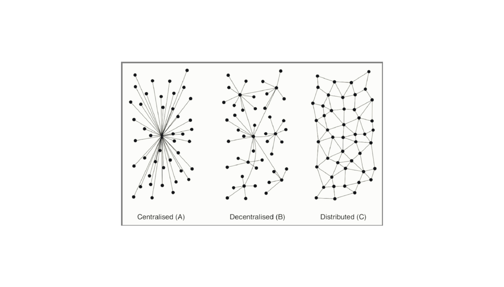
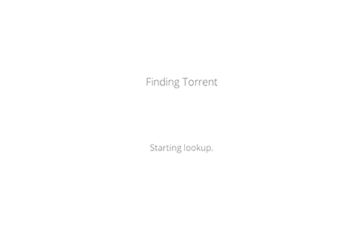
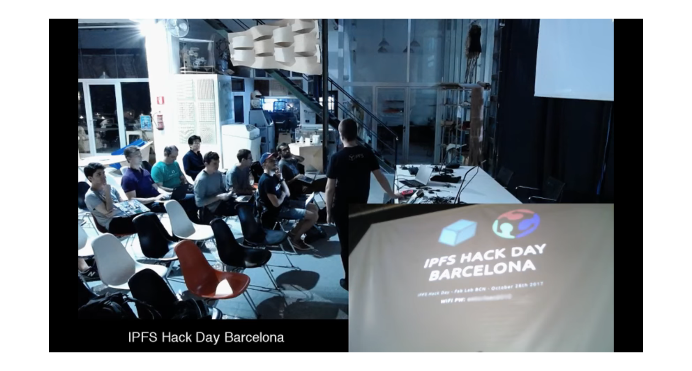
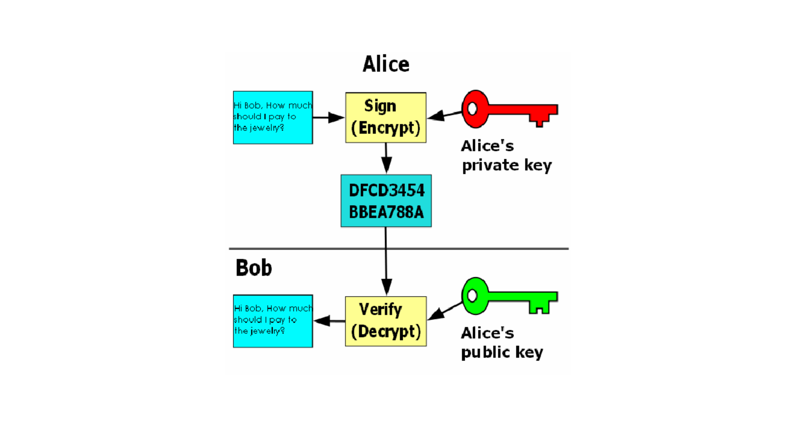
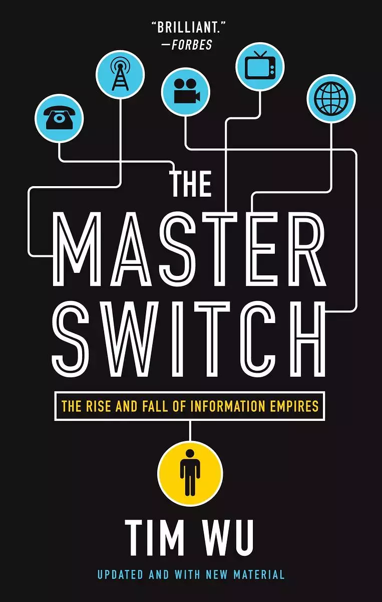

title: '下一代开放互联网'
preview: '随着区块链兴起，分布式技术能否让破碎的互联网涅槃重生？'
author: liuguo
cover: '../images/next-open-internet/11.webp'
date: 2018-07-11 18:00:00 +0800
editor: '沈浪,子川'
design: '童画' 
proof-reader: '小典'
tags:
  - 区块链
  - 互联网
  - 分布式
  - 科技与社会
---

## 前言

在互联网诞生之初，权力分布在每个参与者手中。人们以为每个参与者都有了自己的声音，言论自由迎来了新的时代。激进者如约翰·巴洛，甚至撰写了《赛博空间独立宣言》，宣告这场社会实验已拉开了大幕。

然而互联网诞生近30年后，我们看到了封锁、审查、隐私泄露、舆论控制，看到了资本支撑的网络效应和市场垄断，也看到了商业广告维持的信息经济。随着互联网渗入我们的日常生活，真实世界的权力反过来也渗入了互联网。

理想中的新一代互联网，服务器不再至关重要，无法控制信息的传递。用户与用户直接相连，数据的存储与计算都掌握在用户手中。用户得以保护自身隐私，第三者无法监听或屏蔽用户之间的交互。

比特币等电子货币暴涨后，区块链这一分布式技术也变得家喻户晓。电子货币的泡沫也推动了其他分布式技术，让互联网最初的理想再次成为可能。

这个庞大的拼图，碎片众多，本文选取其中一些已经实现的项目有进行讨论。没有人知道这个拼图会如何实现，不过这个拼图的样貌，终将取决于我们自己。

## 敲响的警钟
2018年3月，Facebook公司遭到联邦贸易委员会调查，面临巨额罚款。公司市值蒸发600亿美元，多名高层出售股票，不少人呼吁卸载Facebook。这一切的导火索，是因为一家名为“剑桥分析”（Cambridge Analytica）的公司，利用脸书数据操控舆论，协助特朗普当选总统。

剑桥分析所做的，是将用户信息收集、数据分析、精准广告投放三者结合了起来。首先，一个小程序邀请Facebook用户进行心理学测试，请求授权读取个人信息。小程序同时记录了用户好友们的信息，并借助关系网络延伸，**最终通过27万名参与者搜集到了超过5千万用户数据**。

剑桥分析根据这些用户的性格分类建立模型，并根据模型将广告投放给目标用户。预先制作好的网页广告引导了用户对现实的认知，进而影响他们的选举偏好。

<small style="color:gray;">因为剑桥分析事件，Facebook CEO扎克伯格参与美国听证会，接受国会提问与质疑。图片来源Anderew Harnik。</small>

媒体巨头操控政治生活的案例并不鲜见。十九世纪末，西联公司曾通过电报网络协助美国第十九届总统当选。2014年也有研究发现，Google对搜索结果的排序可以影响20%的中间选民，足以左右大选结果。

但是，控制信息的平台结合大数据的分析能力，第一次让舆论控制变得如此容易。据英国Channel 4电视台报道，仅剑桥分析及其母公司SCL Group一家，就曾参与过捷克、乌克兰、巴西、肯尼亚、印度等国超过200次的竞选。**其他具有社会资源的团体和个人，如今也可像剑桥分析一样，建立强大的宣传机器，影响人们的想法**。

这远不是警钟第一次敲响。不管是剑桥分析事件，2011年埃及政府切断互联网事件，屡禁不止的金融信息盗窃，还是俄国、中国、伊朗、土耳其等政府对民众进行的信息控制，究其原因，都在于现有网络依赖一个或多个中心服务器。第三方可通过域名污染、DDoS（拒绝服务攻击）等方式阻断用户与服务器的链接，服务器也可对信息进行控制、筛选甚至跟踪。

<small style="color:gray;">插画：[十方](https://www.douban.com/people/a33862560/)</small>

## 龙与屠龙者
互联网并非一直如此。我们所熟知的互联网发源于万维网（World Wide Web），由蒂姆·伯纳斯-李（Timothy Berners-Lee）在欧洲核子研究组织（CERN）工作时设计，最早用于科学家之间传输数据，第一台服务器于1991年上线。

万维网使用Http协议（HyperText Transfer Protocol，超文本传输协议）进行数据传输。这项协议预设了服务器与客户端的分离：服务器负责准备数据（例如网页），客户端浏览器负责接收和处理数据（例如渲染网页代码）。

这样的分离在早期不是问题。早期参与者都有资深的技术背景，足以建立个人服务器，加入分布式内容网络，形成了互联网早期独特而繁荣的亚文化。这种繁荣使得互联网扩散进入大众的生活，同时运营网站与服务器成为少数公司的职能，数据与权力在不知不觉中聚合了起来。

<small style="color:gray;">不同结构的网络形态，从左到右为中心化、去中心化与分布式。目前Facebook、Google、微信、淘宝等平台提供的服务都是中心化的，平台作为中心节点，连接用户。而分布式网络规避了中心化，这样的优势在于，即便任何节点出现问题，剩下的节点也可以绕开该节点重新组建，网络畅通无阻。图片引自Paul Baran (1964)。</small>

这种权力的聚合在互联网早期曾被人们预料到，也曾被互联网的先行者们极力抵制。但在2000年之后，Amazon、Google、Oracle及阿里巴巴等公司云服务兴起，权力的集中与聚合开始加速。

内容的发布方式也是如此。网站从个人网站转型为社交平台，网站内容从个人创作转型为用户生成，网页也从个人发布的静态网页演变为社群共享的动态网页。web1.0时代向web2.0时代迈进，似乎人人都拥有了更大的发声权力，成为一座座信息的灯塔。

但实际上，筛选和审查内容的权力集中于平台，具备价值的社交数据和内容也并不属于用户。用户习惯于内容的免费获取，互联网经济依赖着广告费与广告点击。当用户数据成为商业价值的核心，博取眼球成为平台赖以生存的能力，内容市场便开始劣币驱逐良币。

由于互联网的发展与初衷严重悖离，万维网创始人蒂姆·伯纳斯-李于2016年领导MIT去中心化信息工作组（Decentralized Information Group），协助互联网档案馆（Internet Archive）举办了第一届去中心化网络峰会，第二届也将于今年7月在旧金山召开。这只是诸多重塑互联网的努力之一，意在塑造一个更好的web3.0，将信息控制的权力交还给每位网民。

近几年来，web3.0发展的最大机遇无疑是区块链技术。其中，最引人瞩目的是以太坊项目（Ethereum），它的终极目标是成为新一代互联网基石——“**世界计算机**”（其JavaScript与python的库直接命名为web3.js与web3.py，足见它重塑互联网的野心）。

通过智能合约，区块链使得整个网络不需要相互信任，就能够达成并记录共识。一方面它提供了去中心化的电子货币，使得价值的传递不再依靠点击量与广告商。更重要的是，这为整个网络提供了可靠的分布式逻辑处理，让完全分布式的应用（Dapp, distributed application）成为可能。

但是，逻辑处理仅仅是网络应用需要的诸多资源之一。况且，由于需要达成大范围的共识，区块链技术在设计上就需要牺牲处理能力来换取可靠性。分布式应用仍然需要许多其他的分布式技术作为基础设施。

拿以太坊项目为例，实现“**世界计算机**”取决于区块链以外的两个子项目：一是用于分布式存储的Swarm，二是用于点对点即时通信的Whisper。但Swarm尚不稳定、开发滞后，Whisper更是尚在萌芽中。

所幸，分布式系统既是计算机科学的重要研究领域，也是互联网自由主义者们不曾停止探索的疆域。众多想法跟随区块链一起受到关注，不断复兴、演变，成为现实中的技术。这些技术所推动的研究与应用，将会从其他角度重塑互联网。

互联网的本质，也正在于人与人之间信息的自由交换。也许重塑互联网的第一步，便是实现这种数据存储与传递的新方式——分布式储存。

## 分布式存储的复兴
分布式互联网所需的储存技术，实际上与P2P（点对点）文件传输系统相同。无论是被称作“暗网”的Freenet、I2P和ZeroNet，还是用于文件下载的BitTorrent、ed2k（电驴）、kad网络和快播，都是通过用户间的直接数据交换来传递，极少依赖服务器。P2P网络曾在2009年占到互联网流量的43%-70%，抵达巅峰。然而近十年，随着视频网站的兴起和版权意识的提高，这一比例不断走低。

<small style="color:gray;">大部份P2P系统采用DHT数据结构，让节点不依赖中心服务器就能找寻其他节点。当一个节点试图寻找一份文件时，会向临近的节点广播文件指纹（hash），请求协助和找寻更多节点。找到拥有文件的节点后，两个节点可以建立连接、开始下载。图片来源：http://www.bittorrent.com/</small>

通过**分布式哈希表**（DHT，distributed hash table）技术，分布式系统里的任何节点仅需知道少数邻近节点的地址，就可通过这些节点不断向外搜索其他相应节点，最终获取相关信息。这样的网络具有更强的可塑性，任何节点出问题都无法影响整体网络运作，同时再多节点加入也不会影响网络的传输及寻址效率。

基于过往的一场又一场网络实验，许多项目将最优秀的想法整合在一起，形成一整套分布式算法与协议组成的生态系统，Sia、Storj、Maidsafe、IPFS和Dat Protocol都是其中的例子。

### IPFS

2017年5月，由于维基百科拒绝删除词条中关于土耳其政府与叙利亚圣战主义者的段落，导致土耳其政府下令封锁维基百科。土耳其民众将土耳其语维基百科储存在了分布式网络之中，得以绕开封锁。

2017年10月，西班牙加泰罗尼亚地区决定针对独立举行全民公投，西班牙政府封锁了所有加泰罗尼亚域名的网站，阻止公投进行。但加泰罗尼亚政府与民众将投票网站建立在了分布式网络之中，最后仍有超过40%的公民成功参与了投票。

这两次反封锁行动采用的都是IPFS（InterPlanetary File Syste9m，星际文件系统）网络。这个漫画般的名字一方面是对计算机科学家Joseph Licklider的致敬：Joseph Licklider在Licklider担任美国国防高级研究计划局主任时，曾提出“星系间计算网络”（InterGalactic Computer Network），最终成为了世界上第一个运营的封包交换网络，全球互联网始祖ARPANET（由美国国防部开发，1969年11年正式投入运行）。另一方面，这个名称也昭示了IPFS的野心：为人们提供可靠且高效的数据传输方式，即便人类移民火星，仍能在星际间传输数据。

<small style="color:gray;">加泰罗尼亚地区的技术高手们汇聚巴塞罗那，通过IPFS寻找绕开封锁的办法。图片引自
https://github.com/ipfs/community/issues/270</small>

IPFS的野心远不止于突破封锁，它的最终理想是将分布式存储变为计算机文件系统中的一部分。这个项目想要解决的是目前互联网数据传输的根本问题：数据过分依赖单一节点，传输效率低下；数据未能有效加密，用户隐私无法得到保障；网页与链接常常在数天后失效，内容再也无法提取，人类历史也随之消亡。

除了通过DHT等算法寻找节点外，分布式储存的另一关键技术是内容寻址。在目前HTTP/HTTPS组成的网络中，用户输入的域名（例如https://www.google.com或https://www.baidu.com）被层层解析、对应到服务器地址后，用户再与服务器建立连接。而IPFS采用的内容寻址模式，用户只要直接输入所需文件（比如网站主页html文件）的指纹，程序即可在网络中找寻到拥有该数据的节点建立链接，传输数据。

这种文件指纹又被称为hash，是哈希函数的计算结果。哈希函数的作用类似于数字摘要，将任意长度的数据转换为固定长度的字符串。同时，只要原数据发生任何改变，计算出的hash都会不同。以hash作为网址意味着，同样的网址一定会得到同一个文件，网页链接永远可靠，所以IPFS也被称作“永久网络”（Permanent Web）。

一个文件的hash可以和另一个文件加和之后，进行哈希函数计算，形成第二个hash。如此一来，不同的文件可以通过hash相互连接成文件树，大文件也可以分块后再串在一起。这种结构被称作哈希树（或者默克尔树，Merkle Tree），这是一种在分布式系统中逐渐开始流行的数据结构。不管是常用的代码管理工具git，遍布世界的Bittorent，还是各色各样的区块链，都是某种形式的哈希树，能够直接储存于IPFS网络中，高效地识别和调用。

<small style="color:gray;">IPFS（左上）、Bittorrent（中上）、git（右上）、比特币（左下）、以太坊（右下）都是某种形式的哈希树，天然适合以同样的方式进行存储和传输。图片来源：IPFS主创Juan Benet演讲PPT。</small>

既然是分布式储存，数据就也需要一定的“冗余度”，保证网络中有多个拷贝。同时，需要有一些节点长期在线，保持数据可读。为了解决这个问题，IPFS创造了电子货币Filecoin，让用户可以通过Filecoin来交易各自的存储空间，提供缓存节点。这同时创造了一个基于区块链的云存储市场，有望和亚马逊、Google及阿里巴巴等云服务商竞争。

### Dat Protocal
IPFS团队在公众面前频繁亮相，从Y Combinator新闻、硅谷的Tedx到斯坦福大学的计算机系统研讨会，通过Filecoin进行ICO，又从Union Square Ventures等风投公司获得了近亿元的投资，成立公司ProtoLab。相比IPFS项目的来势凶猛，另一个项目Dat Protocal，则显得低调而神秘，但却另辟蹊径建立起了高质量的生态系统。

Dat Protocal团队的发展哲学与IPFS大相径庭，核心项目贡献者不过三四人，生态系统中其他项目也不过一两名开发者。互联网历史上有过太多昙花一现的分布式项目，Dat Protocal团队认为它们失败的原因，是项目在足够强大之前吸引了太多的用户和关注，超出了当下的技术和团队的处理能力。

Dat Protocal的贡献者和用户大都是科研工作者，致力于科研数据和文献的自由传播。Dat Project建立的机构Code for Science and Society（CSS），致力于通过软件促进科研与社会公益。CSS只接受如Knight Foundation和Alfred Sloan Foundation这些公益基金的捐赠，核心成员通过自己其他的全职工作支持项目开发。就连推崇的前端框架，也避开了React、Angular和Vue这些有大公司背景的项目，而选择了Choo.js这样一个小众但是轻量、高效的框架。

IPFS采用内容寻址的麻烦之处在于，更新内容也需要更新hash，动态网页需要额外的指针来跟踪不断变化的地址。Dat Protocal的寻址方式则把重心放在发布者上：文件的地址本身是发布者的公钥，而文件内容由发布者的私钥加密与签署，拥有地址的用户可以解密并验证文件来源。

<small style="color:gray;">通过非对称加密，用户可以生成一对字符串：私钥和公钥。私钥和公钥的特性在于：私钥可以用来加密一段数据，而公钥则可以解密这段数据。例如上图中，Alice有一段只有自己知道的私钥，和一段她的联系人都知道的公钥。当Alice想要向Bob发送一段重要信息时，她可以把这段信息加密后传给Bob，Bob收到后可以用公钥解密。这样，既避免了信息被拦截和阅读，也验证了发送者的身份。</small>

尽管只投入了很少的精力与人力，Dat Protocal生态系统依然贡献了许多高质量的组件，如分布式网盘Hyperdrive，同时Dat网络之中也有了一些高质量的应用，例如Sciencefair（一个使得科研工作者能够绕开版权限制，直接点对点共享文献的桌面应用）。相比IPFS，Dat Project的这种构架更适合实时交互和流媒体传播。比如，通过Dat Project实现的Hyebercast项目，足以让用户之间不依赖服务器即可直接进行视频通话。

相较普通用户而言，分布式网络的最大门槛在于接入。就像2000年左右互联网第一次兴起时，人们需要学习如何购买互联网运营商的服务、选择浏览器及注册邮箱等。降低这个门槛将会是决定分布式网络存活的关键。值得庆贺的是，现在Dat项目已经有了相当好的浏览器支持：Beaker桌面浏览器可直接支持Dat协议，移动端浏览器Bunsen也正处于开发之中，而发展迅速的Brave浏览器将计划在今年支持Dat协议。

<small style="color:gray;">插画：[十方](https://www.douban.com/people/a33862560/)</small>

## 域名与身份
在目前的互联网上，与存储同样中心化的是域名的解析。当我们通过浏览器访问一个网址时，浏览器需要先通过层层域名服务器获取目标网站服务器的IP地址，才能建立连接和传输数据。层层服务器被作为中心节点来联通整个互联网，导致了整个互联网都处于脆弱的境地。

位于美国加州的ICANN（互联网名称与数字地址分配机构）目前掌管了最高层级的域名与IP地址分配。ICANN近年来开始独立于美国政府、逐渐进入类似于联合国的全球治理模式，但是仍然是一个容易攻击和屏蔽的核心节点。同时，各个地区也可以绕开和屏蔽ICANN域名系统，建立自己的域名管理服务器，把全球割裂成许多局域网，例如朝鲜的“光明网”。

建立一个真正的分布式网络需要一个同样分布式的域名系统（DNS）。即便通过内容寻址，网址可直接对应上用户想找的内容，但不便记忆的哈希值或公钥却增加了使用的难度。所以需要一份记录，把用户能够直接记住的域名（例如baidu.com或者google.com）对应到哈希值和域名的所有者。

这种分布式域名正是一个分布式账本，是区块链的直接应用。2011年，比特币的第一个分支Namecoin项目就已经实现了这个想法，使得顶级域名“.bit”不再需要ICANN管辖，所有人都可以自由注册。随后，这个想法也在不同的项目里得到了实现，例如以太坊项目的域名系统ENS，或者IPFS的域名系统IPNS（InterPlanetary Name System）。

分布式域名管理的另外一个痛点，是建立分布式的用户身份。在传统的网站平台上，用户通常会将自身ID、头像、年龄、地址及购买记录等个人信息存储于平台数据库中。其他服务商可向平台获取用户授权、甚至直接购买用户信息，并记录在自己的数据库里。这正是Facebook剑桥分析事件发生的根本原因。除此之外，平台也可利用用户的个人信息进行精确广告投放，获取广告盈利。而这正是Facebook、Google、百度等网络公司的主要收入来源。

在分布式用户身份的构想中，用户身份对应的只是区块链中一个智能合约地址，个人的所有重要信息可加密储存于分布式网络中。这个智能合约需要包含许多功能，例如便于记忆的名号、恢复密码的逻辑（例如好友验证）、加密/解密个人信息等。更重要的是，它可在不透露用户信息的情况下验证用户的身份：例如，一个服务需要验证用户年龄是否超过18岁，而作为身份管理的智能合约，需能回答用户是否已满十八岁、由什么官方机构证明，而无需透露实际出生日期。

目前应用最为广泛的分布式身份之一是uPort，它的智能合约基于以太坊，信息存储基于IPFS。在早已接受电子货币等新技术的瑞士城市楚格，uPort与当地科技公司及政府合作，对市民开放了uPort身份注册：一旦政府确认了市民提交的身份，当地市民即可通过自身身份登入市政府公共信息系统，智能完成税收等诸多业务。这一合作，为政府执政的进一步自动化奠定了基础。

另一个发展迅速的类似项目是Blockstack，同时向网站和用户提供分布式域名系统。通过兼容和整合不同的储存系统和区块链系统，Blockstack一方面简化了用户注册流程，另一方面降低了开发者进入分布式应用开发的门槛。最近，Blockstack上线了网站 https://app.co/，整合挑选了诸多Dapp（分布式应用），成立了第一个在线Dapp商店。

由于用户身份问题需要基建和规模效应，微软、IBM、uPort、Blockstack等公司联合起来成立了分布式身份基金会（Decentralized Identity Foundation），组建未来的分布式身份生态系统。这个领域将会是之后巨头相争的商业价值核心。

<small style="color:gray;">插画：[十方](https://www.douban.com/people/a33862560/)</small>

## 循环的终结？
信息与传媒技术往往会经历从开源共存到垄断单一的循环。

十九世纪初电报刚发明时，任何人都可以铺设电缆。直到1851年西联公司（West Union）成立，投资建立了最大的电缆网络，将小玩家们迅速挤出市场。而到了十九世纪后半叶，电报网络的基础设施结合音频技术，使得电话网络成为可能，不同参与者开始优化与发明电话网络相关的技术。随后，摩根大通银行注资的AT&T公司完成了对市场的垄断。

电影技术最开始时，同样是独立制片厂林立，而后渐渐变为几大制片厂瓜分市场。早期无线电爱好者团体也相当活跃，独立电台随处可见，并形成了繁荣的亚文化生态圈，然而美国全国广播公司却说服美国联邦政府将无线电频段定为国家所有，迅速完成垄断。而电视技术，甚至未经爱好者阶段，发明初期便被全国广播公司接手垄断。

<small style="color:gray;">哥伦比亚大学法学教授吴修铭在《总开关（The Master Switch）》一书中梳理了传媒技术数次从开源到垄断的循环。</small>

互联网发展更是这种循环的典型：我们在二十世纪末见证了网络文化的繁荣，又在二十一世纪初被涌现的巨头垄断了内容与个人信息。现在，我们又重新站在了新技术涌现的交叉路口上，但与以往截然不同的是，区块链等去中心化技术似乎允诺了一种全新的平等未来。基于这些技术和理念，Mastodon、Blockpress、Akasha等去中心化社交网络雨后春笋般涌现，提供了传统社交网络之外的选择。

这种权力的去中心化，也许是整个共享经济大潮与生产关系扁平化的一部分，以期计算资源本身能够被多方共享。正如Uber、Lyft或滴滴打车平台利用闲置私家车取代出租车公司一样，这些分布式技术也能够通过闲置计算资源取代Uber等公司，将交易还原成为协议，实现“代码即律法（Code is Law）”。当然，这种新兴经济会面临许多新兴挑战，例如当乘客出现安全问题时，将不再有一个核心节点会为事故负责，而杜绝像儿童色情等突破共识道德的内容，将比过去更加困难。（推荐阅读视角的另一篇文章 新的战场：监视与隐私的加密战争）

更大的挑战是，也许广大的用户并不关心自己的隐私与安全。百度CEO李彦宏说中国人“愿意用隐私换取便利”，实则道出了世界范围内互联网的现实：大部分用户只关心眼前体验的流畅，并不在意之后的连锁影响。愿意牺牲便利换回安全和隐私的，向来只是少部分人。

不过，一小部分希望在天空翱翔的人们，带来了飞机；一小部分希望自由交换信息的人们，带来了互联网；另一小部分希望进行自由交易的人们，带来了比特币浪潮。也许在警钟无数次敲响后，我们会在某天看到一个真正分布式的互联网。

<small style="color:gray;">插画：[十方](https://www.douban.com/people/a33862560/)</small>

